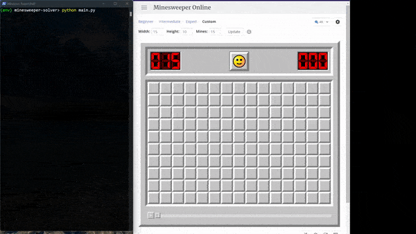

# Minesweeper solver

> :warning: **Using this bot may get you blocked by the game permanently. Use it at your own risk!**



This bot solves minesweeper games on screen by controlling your mouse cursor with [PyAutoGUI](https://github.com/asweigart/pyautogui). The current version is still under heavy development. Right now it can only solve games at https://minesweeper.online/ on a Windows desktop. The bot's [vision](src/vision.py) is mainly built using [OpenCV](https://opencv.org/), whereas the [solver](src/solver.py) is currently a hard-coded deterministic algorithm that has yet to be optimized.

## Installation (Windows only)
Having Python 3.6+ installed, we open up PowerShell:
```powershell
git clone https://github.com/Fanurs/minesweeper-solver.git
cd minesweeper-solver
python -m venv env
.\env\Scripts\activate
pip install -r requirements.txt
```
